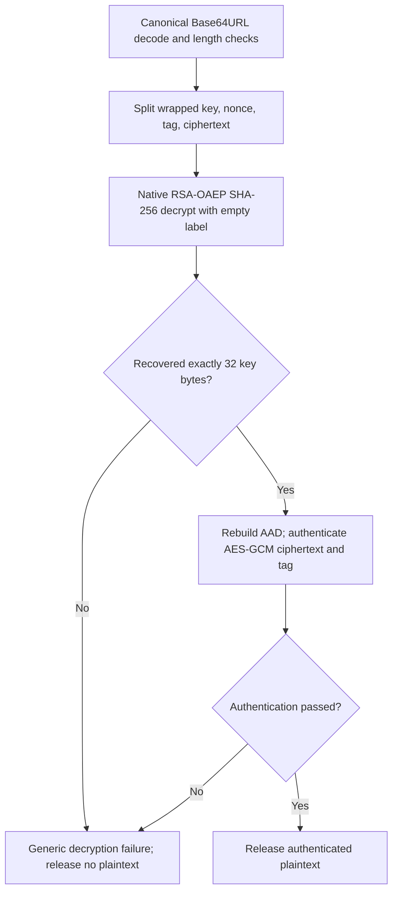

# Zodiac Modern — implementation plan

Planning baseline: 2026-10-03. Status: foundation implementation and verification underway; no completed focused review, integrated audit or release. Current task/milestone evidence: [docs/status.md](docs/status.md). Work tracking: [backlog.md](backlog.md). Contributor rules: [AGENTS.md](AGENTS.md).

## 1. Product and authoritative decisions

Create a professional, calm website where someone chooses a recipient public key, types a message, encrypts entirely in their browser, and saves or shares ciphertext as raw text, a celestial image, or a data-preserving SVG. Ship a **signed downloadable offline Go decrypt CLI** so recipients decrypt using a local passphrase-encrypted private PEM. OpenSSL is used once for key creation; normal encryption uses the website and normal decryption uses one CLI command. The sender can immediately start another message. This receiver choice supersedes the earlier offline-browser proposal.

The current request overrides the historical backend proposals in [context.md](context.md). Preserve the encryption contract in [reference_impl.go.md](reference_impl.go.md), but remove its HTTP service, CORS configuration, server environment, health checks, and throwaway-key behavior from the product architecture. `tamar-recipes-main.zip` supplies Astro layouts, Svelte runes, island organization, CSS tokens, and print conventions; its Sanity, React, video, preview functions, hosting adapter, and recipe content are irrelevant here. The existing `encrypt_flow.png` and `decrypt_flow.png` are historical reference assets: the former depicts backend processing, and the latter contains the inaccurate `rand.Reader` blinding label. Preserve them as references, exclude them from public product documentation, and produce corrected code-native diagrams during implementation.

| Decision | First-release specification |
| --- | --- |
| Stack | Astro static output + `@astrojs/svelte` + Svelte 5 + strict TypeScript |
| Cryptography | Native browser WebCrypto; RSA-OAEP-SHA-256 + AES-256-GCM |
| Recipient keys | Default static SPKI public PEM; local file/paste override; RSA-3072 or RSA-4096 |
| Own key creation | OpenSSL public/private generation once, with website instructions; FireDaemon OpenSSL 3.5 LTS Windows recommendation subject to patch/support verification |
| Recipient experience | Offline Go CLI: raw ciphertext `.txt` + encrypted PKCS#8 PEM + hidden passphrase prompt → authenticated plaintext file; no website private-key route |
| Wire compatibility | Exact Go envelope; canonical unpadded Base64URL |
| Symbol presentation | Frozen Lucide-derived celestial artwork; complete one-line SVG preserves ordered vector data but has no v1 importer |
| Actions | Primary copy raw/download ciphertext; secondary copy artwork image/download one-line SVG/save SVG-PNG pages/print |
| Recovery | v1 raw `.txt`/paste and printed-row checks; SVG artwork export in v1, untrusted-SVG import/restore in v1.1 only after fuzzing/review |
| State | Current tab memory only; one result at a time; no message history |
| Networking | Static assets at page load; no remote request in any encryption/key-import/restore/export action |
| Styling | CSS tokens and scoped Svelte CSS initially; Lucide for controls; Tailwind/shadcn-svelte optional only if justified |
| Hosting | Vercel primary; Cloudflare Pages/Netlify alternatives; Surge conditional on enforced headers; static artifact with no runtime adapter/compute |
| Language | English first; Unicode message support including Hebrew/Arabic; layout ready for later translation |
| Offline use | Independently verified sender release: prefer self-contained file:// HTML if EN-04 passes; signed static launcher is conditional fallback; Go decrypt executable remains separately signed; pnpm local use always supported |

### First-release exclusions

No website backend/API, Sanity, accounts, database, cloud storage, message delivery, sharing URLs, website private-key import/generation, browser decryption, online decryption, message signing, multiple recipients, password-based message encryption, files as plaintext, compression, automatic padding, message history, analytics, service worker/PWA, OCR, untrusted-SVG import/restore, Unicode symbol-string sharing, or QR recovery dependency. SVG restore is phased to v1.1 with its own fuzzing/security gates. A separately verified offline recipient CLI is part of the product boundary; it must never become a hosted private-key page or decryption endpoint. A password protects the local private-key file only; it is not the message encryption scheme.

## 2. Security objectives and honest claims

### What the product can promise

In the intended sender build, plaintext and temporary AES material are processed locally and never submitted to the host. The hosted website receives static asset requests only. Only a holder of the matching RSA private key can normally decrypt the exported envelope. The **hosted sender frontend** has no private key/decryption route. The separately distributed Go receiver handles private keys/passphrases in its local process memory, an explicitly different trust boundary selected by the user.

Use visible copy: **“Encrypted in your browser. Your message is not sent to a server.”** Explain alongside recipient information: **“Only the holder of this recipient's private key can decrypt it.”** This is a client-side privacy property, not a zero-knowledge proof protocol.

If the operator also holds the default recipient private key, they can decrypt ciphertext that someone shares with them. They do not receive it automatically. Do not claim that the operator can never read default-key messages. A custom recipient changes who can decrypt, not the trust required in the delivered application code.

### IND-CCA2 objective

IND-CCA2 concerns indistinguishability of equal-length encrypted messages even when an adversary can adaptively query decryption of other ciphertexts. RSAES-OAEP has a conditional security argument under the RSA assumption and random-oracle modeling; this does not certify an entire website or an arbitrary receiver implementation. [RFC 8017, section 7.1](https://www.rfc-editor.org/rfc/rfc8017#section-7.1)

The proposed hybrid construction combines OAEP key transport, a fresh independent AES key, authenticated encryption, and binding of the wrapped key and nonce. Our design inference is that these are appropriate ingredients for the requested CCA-resistant envelope. A qualified cryptographic reviewer must assess the complete composition, decoding rules, key policy, and receiver behavior before an explicit **IND-CCA2-secure** claim is published. Passing tests demonstrates compatibility and catches regressions; it is not a proof.

Having no website decryption oracle reduces exposure but does not establish IND-CCA2. Any receiver must authenticate before releasing plaintext, use the fixed algorithm suite, reject malformed envelopes, and avoid exposing distinguishable cryptographic failures. Public-key encryption provides no sender identity: anyone with the public key can make a valid message.

### Threat model

| Threat | Control or boundary |
| --- | --- |
| Host logs/exfiltration in the intended code | No submission, API, telemetry, remote SDK, or sensitive network request; production network tests |
| Ciphertext tampering/splicing | Fixed suite, OAEP, AES-GCM authentication, AAD binding; negative interoperability tests |
| Wrong/substituted recipient | Visible recipient identity, full public-key fingerprint, external verification instructions, build-time key consistency check |
| Lookalike domain, search-ad clone, or fake download | Establish exact official origin and expected native publisher through an independent channel; bookmark/install from that source, compare recipient identity separately, and use the pinned local release for sensitive messages; web badges/TLS alone do not prove authenticity |
| XSS/dependency compromise | No untrusted HTML, restrictive enforced CSP, local assets, small pinned dependencies, artifact review |
| Malicious operator/compromised deployment | Can replace JS/plaintext handling/PEM/fingerprints together; CSP/same-origin pins cannot defeat this; use independently verified pinned local bytes before typing, delivered as tested self-contained HTML or a verified localhost bundle; no automatic updates |
| Device compromise/extensions/cloud keyboards | Outside the web app's protection; input preferences reduce some exposure but do not control the OS |
| Browser/clipboard/print persistence | Explicit exports only; memory-only app state; no guarantee of erasing browser undo, clipboard managers, printers, or saved files |
| Ciphertext length analysis | Envelope exposes exact UTF-8 plaintext byte length once RSA size is known; no padding in compatible v1 |
| Lost private key | Irrecoverable; no recovery service; production setup includes a separate custody/recovery drill |
| Later recipient-key compromise | Can expose old ciphertext; this format has no forward secrecy and RSA is not post-quantum |

AES-256 describes the content cipher, not an overall 256-bit security guarantee. RSA-3072 is conventionally associated with roughly 128-bit classical strength; do not infer regulatory certification from algorithm choice. [NIST SP 800-57 Part 1 Rev. 5](https://csrc.nist.gov/pubs/sp/800/57/pt1/r5/final)

### Corrections to historical context

- AAD binds the chosen wrapped-key/nonce bytes during authentication; it does not by itself prove formal key commitment or superiority to JWE/HPKE.
- Fresh random keys make accidental reuse negligibly likely, not mathematically impossible. Continue drawing a fresh random nonce per message.
- Clearing an owned byte array is best effort. JavaScript strings, native crypto copies, GC, and browser buffers cannot be reliably scrubbed by application code.
- The reference's fake-key branch does not prove constant-time decryption. Its unchecked synthetic-key RNG error and accepted non-32-byte OAEP outputs need receiver-side review.
- Passing `rand.Reader` to Go `DecryptOAEP` does not enable blinding through that argument: current Go documentation says the legacy randomness parameter is ignored. [Go crypto/rsa](https://pkg.go.dev/crypto/rsa#DecryptOAEP)
- Never carry the throwaway default recipient into this app. A usable production recipient must be explicitly configured and its private key retained separately.

## 3. Exact cryptographic and encoding contract

### Inputs and constants

| Parameter | Value |
| --- | --- |
| Plaintext representation | UTF-8 bytes from `TextEncoder`; no trim, Unicode normalization, newline rewriting, or compression |
| AES key | 32 cryptographically random bytes, fresh for every encryption |
| OAEP suite | SHA-256; MGF1-SHA-256; empty label |
| RSA modulus | 3072 or 4096 bits; wrapped key length `k = modulusLength / 8` |
| Nonce | 12 fresh random bytes |
| GCM authentication tag | 128 bits / 16 bytes |
| AAD | Byte concatenation `wrappedKey || nonce` |
| Envelope | Byte concatenation `wrappedKey || nonce || tag || ciphertext` |
| Raw text alphabet | `ABCDEFGHIJKLMNOPQRSTUVWXYZabcdefghijklmnopqrstuvwxyz0123456789-_` |
| Raw text padding | None; no `=`, whitespace, `+`, or `/` |

RSA-OAEP keys are imported as `spki` with `{ name: 'RSA-OAEP', hash: 'SHA-256' }`; WebCrypto fixes MGF1 to the selected hash and an omitted label is empty. The AES-GCM result is `ciphertext || tag`, requiring explicit splitting and reordering for this format. [WebCrypto Recommendation: RSA-OAEP](https://www.w3.org/TR/2017/REC-WebCryptoAPI-20170126/#rsa-oaep), [WebCrypto Level 2: AES-GCM](https://www.w3.org/TR/webcrypto/#aes-gcm)

```text
UTF-8 message bytes (n)
        |
        +--> AES-256-GCM(key, nonce, AAD = wrappedKey || nonce)
                         |
                         +--> ciphertext (n) || tag (16)

random AES key (32) --> RSA-OAEP(recipient public key) --> wrappedKey (k)

envelope = wrappedKey (k) || nonce (12) || tag (16) || ciphertext (n)
raw = unpadded Base64URL(envelope)
symbols = reversible presentation of raw; never input to AES/RSA
```

### Browser implementation recipe

1. Validate secure context, WebCrypto availability, recipient key, and exact input byte limit. Snapshot the recipient fingerprint and operation generation ID.
2. **Before calling `TextEncoder`**, validate the original JavaScript string for unpaired UTF-16 surrogates using `isWellFormed()` where supported or a tested code-unit scan. Reject lone high/low surrogates; accept valid emoji pairs. Only then encode exact UTF-8. TextEncoder substitutes U+FFFD for lone surrogates and offers no rejection flag; checking encoded bytes is too late. Byte counting must follow the same validation order. [WHATWG TextEncoder contract](https://encoding.spec.whatwg.org/#interface-textencoder)
3. Draw `new Uint8Array(32)` using `crypto.getRandomValues` and encrypt those bytes with RSA-OAEP using the imported public key. Assert the output is exactly `k` bytes.
4. Import the same AES bytes using `importKey('raw', bytes, 'AES-GCM', false, ['encrypt'])`. Once RSA encryption and AES import have resolved, overwrite owned raw key bytes; also clear them in the outer `finally` on failures. No `wrapKey` with an extractable content key is necessary.
5. Draw a fresh 12-byte nonce and concatenate the wrapped key and nonce as `additionalData`.
6. Call `subtle.encrypt({ name: 'AES-GCM', iv: nonce, additionalData: aad, tagLength: 128 }, aesKey, plaintextBytes)`.
7. Split the last 16 bytes as the tag; the preceding bytes are ciphertext. Assert ciphertext length equals plaintext byte length.
8. Allocate and concatenate the envelope in the specified order; encode canonical Base64URL without padding using chunk-safe byte conversion. Do not spread large arrays into function arguments or pass Unicode strings to `btoa`.
9. Construct a result with raw ciphertext, key fingerprint, key size, format identifier, length, and display checksum. Publish it only if the operation ID and key selection still match the current state.
10. In `finally`, clear owned plaintext/key byte buffers and release AES `CryptoKey` references. Never log input or error objects that embed user content. On success clear the textarea string and collapse the composer. On failure preserve the user's draft for retry unless they explicitly clear it.

Use real WebCrypto; no CryptoJS/forge, JS RSA arithmetic, Go-WASM, application-created PRNG, AES-CBC, PKCS#1 v1.5, or algorithm fallback. HTTPS is required in deployment; localhost is the development/offline serving path. [MDN SubtleCrypto.encrypt](https://developer.mozilla.org/en-US/docs/Web/API/SubtleCrypto/encrypt)

### Byte offsets and size examples

| Field | Start, inclusive | End, exclusive |
| --- | --- | --- |
| Wrapped AES key | `0` | `k` |
| Nonce | `k` | `k + 12` |
| Tag | `k + 12` | `k + 28` |
| Ciphertext | `k + 28` | `k + 28 + n` |

`envelopeBytes = k + 28 + n`; `rawCharacters = ceil(4 * envelopeBytes / 3)`. Count UTF-8 bytes, not JavaScript string length. For 26 ASCII bytes: RSA-3072 gives 438 envelope bytes / 584 characters; RSA-4096 gives 566 bytes / 755 characters. Empty plaintext is valid at the crypto-library level for interoperability tests; the product disables encryption for a zero-byte draft. Whitespace-only text is allowed and preserved.

The application calls this format `rsa-oaep-sha256-aes256gcm-v1` in documentation and export metadata. **There is no version byte, key ID, magic header, or length field in the raw envelope.** The receiver needs the matching private key and format knowledge; its modulus determines `k`. The fingerprint, display checksum, symbol-map version, and page labels are external metadata and are not authenticated by the compatible v1 envelope.

### Canonical decoding and receiver boundary

Any raw parser must validate alphabet and allowed length, reject lengths congruent to 1 modulo 4, decode with zero trailing pad bits, and require `encode(decoded) === original`. This prevents alternate textual encodings of the same binary envelope. A separately labeled recovery UI may explicitly remove ASCII presentation spaces/newlines from transcribed printed raw chunks before producing canonical raw text; cryptographic decoders themselves receive canonical raw text only.

Go `RawURLEncoding.DecodeString` is more permissive than the intended canonical contract. `Strict()` checks pad bits but still ignores CR/LF, so receiver wrappers must also validate the alphabet and round-trip equality. This matters if ciphertext identity is used for oracle restrictions or replay handling. [Go encoding/base64.Strict](https://pkg.go.dev/encoding/base64#Encoding.Strict)

The offline Go receiver checks minimum size, recovers exactly 32 AES bytes, reconstructs `AAD`, recombines `ciphertext || tag`, and releases plaintext only on GCM success. Incorrect key/wrap/nonce/tag/ciphertext gives one generic decryption failure. No promise of constant-time whole-program execution follows from one error string or synthetic fallback. The public website ships no private-key receiver code. Keep an independent test oracle alongside the supported Go CLI; testing a receiver only against itself is insufficient.

Corrected receiver diagram for documentation (an offline receiver, not a website feature):



This diagram describes semantic acceptance/rejection, not timing behavior. Receiver-side timing defenses still require review; the `rand.Reader` argument is not a blinding switch.

## 4. Recipient keys, authenticity, and lifecycle

### Default recipient

Use `config/recipient.json` for a human-readable recipient name, a public PEM source path, and an expected full fingerprint. The public file is `public/keys/default-public.pem`. A build script reads it, imports/validates it, computes the fingerprint, and generates a public-only TypeScript module for the app. The same PEM is available as a normal static download. Encryption does not fetch it at runtime.

Production builds fail if the PEM/name/fingerprint is missing, invalid, too small, unsupported, or inconsistent. No production key was supplied in the current repository; supplying the **public** PEM, recipient identity, and independently confirmed fingerprint is a launch dependency. Development may run with a deliberately absent default, offering local custom-key import. Automated tests use explicitly named test fixtures that must never enter `dist`.

Use SHA-256 of canonical SPKI DER as the fingerprint; show the full 64 hexadecimal characters in key details and a short, clearly abbreviated label near the composer/result. PEM whitespace must not change it. Canonicalize SPKI through WebCrypto import/export at key-validation time; public keys may be imported extractably for this purpose, while AES keys remain nonextractable. Verify that the build-time Node and browser output produce identical SPKI fingerprints.

The fingerprint is a key identifier, not proof of identity. A same-site value can be replaced with the key and page. Give instructions to compare the full fingerprint with a recipient through an independent trusted channel. Default recipient name must identify who receives messages; do not call it “your key” or suggest the sender can decrypt without its private key.

### Custom public-key import

- Offer file selection and paste; label **“Public key stays on this device.”** Do not describe reading a local file as uploading.
- Accept one `-----BEGIN PUBLIC KEY-----` SPKI PEM block, RSA only. Reject `RSA PUBLIC KEY`/PKCS#1, certificates, private/encrypted-private keys, multiple blocks, extra non-whitespace content, malformed Base64, and oversized files. Provide an offline conversion instruction where appropriate.
- First-release policy deliberately supports exactly 3072/4096 bits and exponent 65537. The source Go code accepts other RSA sizes above the floor; the UI is a documented support subset, not a wire-format change. Broader sizes require performance/interoperability tests and a later policy decision.
- Validate the native-exported public JWK modulus integer as well as algorithm metadata: exactly 384/512 bytes with the top bit set, exponent `AQAB`, and matching bit length. Firefox can round adjacent modulus sizes in metadata. JWK is internal validation only; user input remains SPKI PEM and native SPKI re-export must equal the original complete canonical DER. See [the validation decision](docs/decisions/browser-public-key-validation.md).
- Public PEM input maximum: 16 KiB. Read only after checking file size; do not trust extension/MIME. Clear the file input and paste field after either successful or rejected parsing; retain only validated selection/default public-key state in memory. Return focus to the initiating file/paste control. Explicit public PEM download saves the selected public representation; native textarea input normalizes pasted line endings.
- Display key size, full fingerprint, local filename as escaped text, and recipient label as an unverified local label. Never render PEM/labels as HTML.
- Validate a replacement before installing it. Failed import keeps the prior validated key but clearly indicates that the proposed replacement was not selected. Missing default never selects an unknown fallback.
- Changing key while a result exists must not relabel that result. Results carry an immutable recipient snapshot. Require an explicit “Start a new message with this key” action before replacing the result. Disable key changes during an in-progress encryption.
- “Use default recipient” restores the configured default only when valid. Reload clears custom keys; there is no remembered-recipient database.

### Creating one's own key: one-time OpenSSL setup

The final confirmed split is **OpenSSL key generation, browser encryption, offline Go CLI decryption**. Do not add a browser key generator or custom key container. `/keys/` gives Windows installer steps, copyable commands, expected PEM headers, filenames, permissions, backup, and a recipient test-message check. `/receive/` is an informational guide/download page only: it must never accept private keys/passphrases or decrypt messages.

For Windows, recommend the latest patched **FireDaemon OpenSSL 3.5 LTS** build for the user's architecture. The longer upstream support horizon makes 3.5 LTS a reasonable default over 4.0 for this small RSA setup; a larger major version is not inherently more secure for this construction. As checked on 2026-10-03, upstream/FireDaemon direct pages list 3.5.9 and 4.0.3; OpenSSL lists 3.5 support through 2030-04-08 and 4.0 through 2027-05-14. Recheck current patches/advisories/support at implementation and guide maintenance time; never recommend an old unsupported branch, alpha/beta, or a fixed stale patch indefinitely. [OpenSSL release policy](https://openssl-library.org/policies/releasestrat/), [Current upstream downloads](https://openssl-library.org/source/), [FireDaemon Windows downloads](https://www.firedaemon.com/download-firedaemon-openssl)

Link the direct vendor page, select the right x64/ARM64 package, verify the vendor's expected digital signature/publisher and SHA-256 from trusted release information before execution, and use its documented installer workflow. OpenSSL Windows binaries are third-party distributions, not binaries shipped by the OpenSSL project. Installer provenance matters; using a FIPS-labeled package does not certify this website. Do not bundle OpenSSL into the browser runtime or require FIPS-provider configuration for this feature. [OpenSSL project binary information](https://github.com/openssl/openssl/wiki/Binaries)

In a **new private, nonsynced folder outside the repository**, run these commands once (the website guide must include the actual FireDaemon executable-path/PowerShell variant verified against its installer, `openssl version`, expected output, and a no-overwrite check before generation):

Set restrictive access **before the first command**, not only after a file has been created. On Unix-like systems use a private directory and `umask 077` in that shell before generation; this is not a PowerShell command. On Windows use an appropriately restricted NTFS folder ACL and verify inheritance/access for the generated files. Unix mode 0600 is not a substitute for Windows ACLs or encryption against offline disk theft. Apply these controls to encrypted keys too; they supplement the passphrase. Never overwrite an existing key path during generation/conversion.

```sh
# Generate an encrypted intermediate; OpenSSL prompts for a passphrase.
openssl genpkey -algorithm RSA -aes-256-cbc -pkeyopt rsa_keygen_bits:3072 -pkeyopt rsa_keygen_pubexp:65537 -out rsa-private-initial-encrypted.pem

# Set the supported PBES2 work factor; prompts for input and output passphrases.
openssl pkcs8 -topk8 -in rsa-private-initial-encrypted.pem -out rsa-private-encrypted.pem -v2 aes-256-cbc -v2prf hmacWithSHA256 -iter 600000 -saltlen 16

# Shareable PKIX/SPKI public half: PUBLIC KEY PEM.
openssl pkey -in rsa-private-encrypted.pem -pubout -out rsa-public.pem

# Local validation only; does not print private key material.
openssl pkey -in rsa-private-encrypted.pem -check -noout
```

RSA-4096 users substitute 4096; keep exponent 65537. Only `rsa-public.pem` goes to the sender site or another person. The final `rsa-private-encrypted.pem` (`ENCRYPTED PRIVATE KEY`) goes only to the verified local CLI and remains outside hosted code, repositories/builds, cloud sync, and ordinary shared folders. Use a strong unique passphrase, preferably generated/stored in a trusted password manager. Each OpenSSL passphrase prompt must be explained separately; no passphrase is placed in arguments, environment, shell history, logs, or chats. Test both sizes and emitted headers with the actual CLI and browser public import. [OpenSSL genpkey](https://docs.openssl.org/3.5/man1/openssl-genpkey/), [OpenSSL pkey](https://docs.openssl.org/3.5/man1/openssl-pkey/)

The encrypted intermediate avoids writing a plaintext private file during setup. Its OpenSSL-default work factor is not the final profile: after checking the final key/public pair and testing an encrypted backup, remove the intermediate using OS-appropriate instructions, with no secure-erasure promise. Never sync/back up the intermediate. A retained, snapshotted or recovered intermediate still contains the same private key under its earlier protection; strengthening the final file does not strengthen existing copies. Use a strong randomly generated temporary passphrase as well as a strong final one, and protect the setup disk. Backup the final encrypted file separately and test restoration using the same CLI; a new key cannot recover old messages. File permissions/full-disk encryption remain useful alongside key encryption. The passphrase protects against offline file theft according to its strength and the work factor; it does not protect an unlocked process or compromised device.

The final profile is PBES2/PBKDF2-HMAC-SHA256/AES-256-CBC with 600,000 iterations. This work factor is a design choice informed by OWASP's **password-storage** PBKDF2 guidance, to be performance-tested and reviewed; it is not an OpenSSL-key-file certification or a guarantee that a weak passphrase cannot be brute-forced. It slows each guess; passphrase strength remains essential. CBC here protects the local key file and is separate from the AES-GCM message envelope. The key container is not authenticated AEAD; parsing/unlock failures remain generic and no remote key-unlock oracle is exposed. Re-encrypting the same private key preserves its public half/fingerprint; separate `genpkey` invocations generate different pairs. Only the public half is served in the static Vercel/local sender; there is no Render encryption/decryption service. [OpenSSL pkcs8](https://docs.openssl.org/3.5/man1/openssl-pkcs8/), [OWASP PBKDF2 guidance](https://cheatsheetseries.owasp.org/cheatsheets/Password_Storage_Cheat_Sheet.html#pbkdf2)

The final conversion command targets the recommended OpenSSL 3.5 and explicitly sets a 16-byte salt. OpenSSL 3.5 documents this flag/default; the 3.0 CLI does not offer `-saltlen`. Testing a version is not a promise to accept every container it emits. The early REC-01 fixture matrix must inspect actual salt/PRF/parameters and record successful imports and policy rejections separately; a file with a salt shorter than 16 bytes remains unsupported. For older generated keys, test rewrapping with the supported 3.5 command into a new encrypted file and verify the public half is unchanged, without a plaintext intermediate. Never lower the fixed-profile salt/work-factor bounds to make an old fixture pass. [OpenSSL 3.5 salt-length option](https://docs.openssl.org/3.5/man1/openssl-pkcs8/#options), [OpenSSL 3.0 command options](https://docs.openssl.org/3.0/man1/openssl-pkcs8/#synopsis)

Native WebCrypto imports unencrypted PKCS#8 `PrivateKeyInfo` and cannot directly unlock OpenSSL encrypted PKCS#8. Unencrypted generation is technically possible, but it is not this release's recommended receiver workflow. Go's `x509.ParsePKCS8PrivateKey` also needs already decrypted DER and has no encrypted-PKCS#8 import function. REC-01 now owns a small, fixed-profile loader built from standard-library PBKDF2/AES/CBC/ASN.1/x509 primitives. This explicitly supersedes the earlier prohibition on handwritten PBES2 integration and the third-party decoder selection; it does not authorize custom cryptographic primitives, a general ASN.1 implementation, algorithm negotiation, or legacy fallbacks. Do not use deprecated `x509.DecryptPEMBlock` or an OpenSSL runtime subprocess. [WebCrypto import formats](https://developer.mozilla.org/en-US/docs/Web/API/SubtleCrypto/importKey), [Go x509](https://pkg.go.dev/crypto/x509#DecryptPEMBlock), [Go PBKDF2 API](https://pkg.go.dev/crypto/pbkdf2)

### Offline Go decrypt CLI: trust boundary and ordinary flow

The receiver is a separately built downloadable Go executable, initially Windows x64, using Go's standard RSA/AES/GCM implementations. It never opens a listener, serves a browser UI, makes network requests, updates itself, generates keys, or encrypts messages as a public CLI feature. It needs no Go or OpenSSL installation for routine decryption. Keep its source and release artifacts outside hosted `dist`; the website can link an immutable signed download. Windows ARM64/macOS/Linux are later explicit support decisions.

Normal recipient flow:

1. Download the versioned executable through an independently confirmed release channel, verify its expected Authenticode publisher/signature and artifact hash, and retain that pinned release. `/receive/` explains the verified publisher, full filename, architecture, and Windows verification steps before execution; no “Run anyway” bypass guidance.
2. Save the sender's raw `.txt` and choose a new output path in a private nonsynced folder. Run the one copyable PowerShell command below. File paths are arguments; private contents and passphrases are not. The website guide does not inspect local files or dynamically interpolate untrusted filenames into executable commands.
3. The CLI bounds input before allocation/KDF: one encrypted PKCS#8 PEM up to 16 KiB, ciphertext at most 88,102 characters, then the selected modulus's tighter length bounds. It validates the canonical raw encoding with no implicit whitespace cleanup. A separately explicit `--presentation-whitespace` option may remove only ASCII spaces/tabs/CR/LF, then enforce the identical strict decoder. Refuse SVG/HTML/image inputs with raw-file guidance.
4. Prompt for the key passphrase on the controlling terminal without echo using `golang.org/x/term`; refuse a missing terminal rather than taking a password from flags/env/stdin or recording it. Limit passphrase input (1,024 bytes), restore terminal settings on cancellation, and clear owned passphrase/DER buffers on all paths. Unlock the narrow supported key profile, require a valid two-prime RSA-3072/4096 key with exponent 65537, call key validation, and derive its actual canonical SPKI fingerprint.
5. Parse the modulus-derived envelope, unwrap with OAEP-SHA256 and empty label, **require exactly 32 AES bytes**, rebuild AAD, recombine `ciphertext || tag`, and call GCM `Open`. Produce no output file or plaintext until authentication succeeds. Wrong RSA key/wrap/nonce/tag/ciphertext yields one generic cryptographic failure and the same exit status; no constant-time claim.
6. Save exact authenticated UTF-8 bytes to the explicitly selected new plaintext file. Check UTF-8 validity; refuse unsupported binary content rather than silently replacing bytes. Never print plaintext to terminal/stdout, invoke an editor, execute markup, or copy to clipboard automatically. Reject existing destinations and symlink/reparse redirection; use exclusive creation only after authentication, apply OS-appropriate private permissions, and remove any partial output on write failure. Windows output must be an ordinary local-disk file: reject UNC/network paths and mapped network drives, pipes/devices and `\\.\`/`\\?\` namespace forms, alternate data streams, drive-relative paths and reserved device components/aliases. Inspect all parent directories for reparse points and validate local volume/file type using OS handles; lexical validation/final-component checks alone are insufficient. Test parent replacement races and restrictive ACLs; mode 0600 alone does not establish Windows privacy. Input paths must also preserve the receiver's offline/no-network boundary. Success prints a nonsecret receipt/fingerprint and output location, then exits and clears owned buffers/references best effort. Saved plaintext, OS caches, Go key integers/expanded crypto state, and paging cannot be guaranteed erased.

```powershell
.\zodiac-decrypt.exe decrypt --key ".\rsa-private-encrypted.pem" --in ".\ciphertext.txt" --out ".\message.txt"
```

This is a planned command contract, not an existing executable. `--help`/`--version` never unlock keys. Stable exit codes: 0 success; 2 usage/input format; 3 key-unlock failure; 4 generic message decryption failure; 5 output I/O; cancellation documented separately. Cryptographic message failures do not distinguish OAEP/GCM/tag/key mismatch. Key-unlock errors are local, never a remotely queryable service. Each message is a fresh process; no resident key cache/history. Record usability testing of setup and one-command decryption with nontechnical recipients; the CLI remains a user-accepted friction point, not a claim of browser-like ease. [Go terminal password input](https://pkg.go.dev/golang.org/x/term#ReadPassword)

Accept only the guide's encrypted PKCS#8 profile in v1: PBES2 with explicit PBKDF2-HMAC-SHA256, AES-256-CBC, 16–64-byte salt, 16-byte IV, optional derived-key length absent or 32, and iterations 600,000–2,000,000. Validate parameters/DER/file bounds before expensive work; reject duplicates, trailing content, unsafe/unknown algorithms, unencrypted/legacy/PKCS#1/public/certificate/multiple PEM blocks, and malformed padding. The upper bound prevents resource abuse and requires measured usability; future profiles require an explicit versioned policy change. The repository-owned loader, standard-library/toolchain updates, fuzzing, synthetic OpenSSL fixtures, and independent review are P0 implementation/release gates.

For the documented interactive Windows setup, use a strong ASCII-only passphrase until OpenSSL console encoding and the Go UTF-8 prompt have been proven compatible on supported Windows configurations. Non-ASCII UTF-8 file-based synthetic fixture success does not establish interactive console compatibility. Do not normalize passwords or try fallback encodings.

### Fixed-profile encrypted-PKCS#8 loader (REC-01)

Implement `receiver/internal/keyfile/pbes2.go` using `encoding/pem`, `encoding/asn1`, `crypto/x509/pkix`, `crypto/pbkdf2`, `crypto/sha256`, `crypto/aes`, `crypto/cipher`, `crypto/subtle`, `crypto/rsa`, and `crypto/x509`. Separate bounded parse-and-policy validation from costly unlocking. No imported encrypted-key decoder, algorithm registry, custom KDF/cipher, custom ASN.1 length/TLV parser, or format autodetection is permitted. Keep the code small and reviewable; an estimate of 150 lines is not an acceptance criterion or reason to omit checks.

**Start REC-01 in M0 alongside EN-01, before the wider EN-02 interoperability harness and M1 browser crypto; do not defer it to M2.** The loader's owned ASN.1/schema/padding integration is the highest-priority implementation risk to resolve. It needs neither the frontend scaffold, browser public-key importer, production keys nor the completed envelope harness. First pin the supported Go toolchain and isolated OpenSSL 3.0/3.5 fixture generators, generate synthetic RSA-3072/4096 cases with actual versioned executables, then prototype pbes2.go against them. Only synthetic fixtures/test passphrases may be committed; never production private material. This scheduling independence does not authorize extra agents.

REC-01's M0 completion gate requires the real-fixture/oracle results, strict-schema negative corpus, pre-KDF stub and post-KDF fuzz targets with recorded runs/resource bounds, uniform local failures, supported KDF latency measurements, dependency integrity and an independent focused loader review with fixes verified. Record tool versions/providers, commands, fixture hashes/public fingerprints, decoded profile fields, expected outcomes, fuzz commands/durations/corpus/failures and reviewer findings; an algorithm-level mock or a prototype demo is insufficient. These gates are mandatory at foundation completion and must be maintained/re-run in CI and system review through release; they cannot be deferred or waived to meet the schedule. A later loader/policy/toolchain change reopens the affected evidence. QA-03 still reviews the integrated system separately; early loader review is not a full-product audit.

| Field | Required v1 value |
| --- | --- |
| Outer algorithm | PBES2, OID `1.2.840.113549.1.5.13`; parameters present |
| KDF | PBKDF2, OID `1.2.840.113549.1.5.12`; parameters present |
| PBKDF2 salt | Primitive OCTET STRING, 16–64 bytes; reject `otherSource` |
| Iteration count | Positive INTEGER, 600,000–2,000,000; reject overflow before conversion/derivation |
| PBKDF2 key length | Field absent, or explicit INTEGER 32; explicit zero is rejected |
| PRF | Explicit AlgorithmIdentifier with HMAC-SHA256 OID `1.2.840.113549.2.9` and DER NULL parameters |
| Encryption scheme | AES-256-CBC, OID `2.16.840.1.101.3.4.1.42`; parameters are one primitive 16-byte IV OCTET STRING |
| Encrypted data | Nonempty primitive OCTET STRING; length divisible by 16 and within the 16 KiB file/DER bound |
| Decrypted key | PKCS#8 version 0, RSA `rsaEncryption` OID `1.2.840.113549.1.1.1` with NULL parameters, two-prime RSA-3072/4096, e=65537 |

Absent PRF means HMAC-SHA1 in PBKDF2 and must be rejected, not interpreted as SHA256. PRF NULL parameters are the fixed OpenSSL profile; absence or another parameter encoding is not silently accepted. Test this policy against actual supported OpenSSL output. Optional key-length presence must be tracked explicitly; a struct's zero-value integer must not make an encoded zero indistinguishable from absence. [RFC 8018 PBKDF2/PBES2 definitions](https://www.rfc-editor.org/rfc/rfc8018)

Loader stages:

1. Read at most 16 KiB plus a one-byte overflow sentinel. Require exactly one `ENCRYPTED PRIVATE KEY` block with no PEM headers and no extra block or non-whitespace prefix/suffix; only ASCII presentation whitespace around the block is allowed. `pem.Decode` can skip text, so successful decoding alone is insufficient. Reject oversized input before ASN.1 parsing; bound all decoded allocations to the file cap.
2. Parse the `EncryptedPrivateKeyInfo` SEQUENCE as exactly an algorithm identifier and encrypted-data OCTET STRING. Walk the fixed-depth nested schema with `asn1.RawValue` and standard unmarshalling; check expected class/tag/constructedness, exact member counts, field order, and complete consumption at **every** SEQUENCE/parameter/scalar. The outer `rest == empty` check alone is insufficient: Go's struct decoder can ignore unmatched trailing SEQUENCE members. Reject unknown/duplicate members, malformed/nested lengths, primitive/constructed substitutions and missing or extra parameters. This is bounded schema validation around the standard parser, not a new ASN.1 parser. [Go ASN.1 unmarshalling contract](https://pkg.go.dev/encoding/asn1#Unmarshal)
3. Validate every OID, integer, salt, IV, key-length presence and ciphertext length in the table before calling the KDF. Return a validated internal profile, with no attacker-controlled choice of hash/cipher or unchecked work factor. Unsupported/malformed profiles never invoke PBKDF2, allocate unbounded buffers, or reach CBC with invalid block/IV lengths.
4. Derive exactly 32 bytes with `dk, err := pbkdf2.Key(sha256.New, string(passphraseBytes), salt, iterations, 32)` and handle the error. The standard API takes a **string**, not a byte slice, and returns an error. Preserve the entered password bytes exactly without normalization or fallback encodings. Clear owned password bytes in a deferred cleanup, but the immutable password string and internal copies cannot be reliably wiped; do not use unsafe conversions or reimplement PBKDF2 to imply otherwise. [Go PBKDF2 API](https://pkg.go.dev/crypto/pbkdf2)
5. Create native AES/CBC and decrypt into a bounded owned buffer. Validate PKCS#7 padding with a uniform scan of all 16 bytes in the final block, combining the 1–16 length check and byte checks before deciding success; no early return on the first padding mismatch. Standard constant-time comparison helpers may support this local check, but the whole loader is not promised constant-time. Do not parse a padding-invalid plaintext.
6. Require exactly one complete PKCS#8 object with no trailing bytes or unexpected attributes. Check the fixed version-0/RSA-NULL wrapper and complete inner two-prime PKCS#1 shape (version 0 and nine INTEGER members, no extra fields) using the same bounded schema checks, then call `x509.ParsePKCS8PrivateKey`. Require `*rsa.PrivateKey`, `len(Primes) == 2`, `E == 65537`, modulus bit length exactly 3072 or 4096, and `Validate()` success. Explicitly require `d*e mod (p-1) == 1` for each of the two primes alongside native validation, so CRT acceptance cannot bypass the encoded private exponent. A successfully parsed object alone does not satisfy the key policy.
7. Defer clearing the derived-key bytes, the **entire** decrypted allocation including padding, and owned passphrase buffers on success, failure and cancellation; release key references when the one-message process exits. Go strings, RSA big integers, expanded cipher state, allocator/OS copies and paging remain outside a guaranteed-erasure claim. All key-format/profile/password/padding/inner-key validation failures map to the same local key-unlock message and exit 3, without ASN.1/padding diagnostics; CLI usage/ciphertext syntax errors remain exit 2 and filesystem failures keep their separate I/O category. One error does not authenticate this CBC container or establish timing equivalence. Never expose unlock as a network service.

Read [youmark/pkcs8](https://github.com/youmark/pkcs8), [the .NET RSA import source](https://github.com/dotnet/runtime/blob/main/src/libraries/System.Security.Cryptography/src/System/Security/Cryptography/RSA.cs), and [the .NET password-based encryption source](https://github.com/dotnet/runtime/blob/main/src/libraries/Common/src/System/Security/Cryptography/PasswordBasedEncryption.cs) as **read-only references** for structures/OIDs/operation order and cleanup. Record the specific inspected commits in the implementation decision; do not import these libraries, mechanically port their general algorithm support, inherit permissive parsing/defaults, or describe the owned glue as audited. Any later authorized source reuse requires license/provenance handling. The existing Go reference remains the message-envelope reference, not an encrypted-key loader.

.NET's `RSA.ImportEncryptedPkcs8PrivateKey(passwordBytes, pemDerBytes, out bytesRead)` is a useful independent implementation reference: its input is decoded binary key data, not PEM text. A strict test wrapper checks `bytesRead == pemDerBytes.Length` rather than discarding it with `out _`; .NET's broader BER/algorithm acceptance is not our profile policy. An optional CI-only .NET differential harness can compare supported fixtures using identical password bytes and canonical public keys. No .NET runtime is required by the shipped Go CLI. [Microsoft encrypted-PKCS#8 import contract](https://learn.microsoft.com/en-us/dotnet/api/system.security.cryptography.rsa.importencryptedpkcs8privatekey?view=net-10.0)

Mandatory tests start in M0 with real OpenSSL 3.0 and 3.5 `pkcs8 -topk8` fixtures for both RSA sizes and each branch's `pkcs8 -in` as a local oracle, comparing the decrypted key's canonical public half rather than printing private material. Use isolated pinned generators, record actual emitted parameters, and explicitly distinguish supported-profile success from expected policy rejection; include 3.0-origin keys rewrapped under 3.5 with a 16-byte salt and unchanged public halves. Do not claim a 3.0 CLI output is supported without matching the complete fixed profile. Exercise valid profile boundaries, wrong passwords, every padding length 1–16, corrupted padding, unsupported keys and malformed encodings. Fuzz parse-and-validate independently with a test-only KDF stub/call counter so hostile iterations never burn real PBKDF2 CPU; production always uses the native KDF. Add a bounded post-KDF CBC/padding/inner-key fuzz target. Seed SHA1/absent PRF, PRF without NULL, wrong OIDs, explicit zero/wrong key length, 10^9/negative/overflow iterations, a 1 MiB salt/file, short/long IV, zero/non-block ciphertext, prefix/trailing bytes, extra nested SEQUENCE members and adversarial lengths. Oversized files must be rejected at the boundary before their contents reach the parser. Require no panic, bounded work/allocation, and rejection before KDF where applicable. Independent review covers this glue and its tests, not just the standard cryptographic primitives.

Use [reference_impl.go.md](reference_impl.go.md) for `DecryptHardened`'s envelope offsets, SHA-256 OAEP, AAD reconstruction, tag recombination and GCM authentication. Extract a small testable library; remove all HTTP/CORS/env/server initialization and throwaway keys. Strengthen canonical decoding, exact 32-byte AES recovery, input/key bounds, cleanup and output handling. Do not repeat the synthetic-key constant-time or `rand.Reader` blinding claims; the unchecked synthetic RNG result is a defect, not a pattern to copy. Default to reviewed native decryption semantics without inventing fake timing guarantees; a proposed fallback must itself handle RNG/key-length failures and receive review.

### Key-pair confirmation and a real recipient readiness check

Key creation stays in OpenSSL. The CLI's `verify-key --key <encrypted.pem> --public <public.pem>` prompts locally, validates both files, derives canonical SPKI from the actual private key's public half, and requires full DER/fingerprint equality. It outputs only nonsecret key size/full fingerprint. Independently compare that fingerprint with the sender's selected recipient; file names/export metadata are unverified hints. There is no automatic network lookup or silent use of the website's default public key.

Before real use, sender and recipient complete an optional guided **test-message round trip** with a fresh nonsecret random token. The recipient reads the authenticated token from the CLI's saved text file and compares it through the existing trusted channel, with no API/callback. The sender cannot prove private-key possession by encrypting locally or by reading a checksum. Recipient confirmation improves configuration confidence but is neither sender authentication nor a guarantee about later code/delivery. Default-recipient production readiness requires this drill.


### Rotation and loss

Change the configured key and fingerprint in one reviewed build; publish the new fingerprint through the independent channel. New messages use the new key. Old ciphertext still requires the old private key; retain old private keys separately according to custody policy. The raw format has no recipient discovery mechanism. Saved export headers include the key fingerprint for humans/tools, but plain “Copy raw” remains exactly the compatible string. No silent re-encryption or automatic key retirement.

## 5. Symbols and recoverable exports

### Confirmed sharing decision

The user selected **same glyph appearance: copy/save an image for email, plus raw ciphertext; download all glyphs as a reversible one-line SVG**. Unicode symbol strings are deferred because ordinary email fonts would not preserve the Lucide artwork. The on-screen plate may be a grid, while the complete vector sharing artifact is one ordered line.

**Celestial glyph map (`S64L1`)**: frozen vector icons, one per raw Base64URL character, based on the context's 64-icon taxonomy. Reuse exactly the same paths in the screen plate, one-line SVG, paged SVG/PNG, and print. Package updates must not silently change old artwork or character order.

**SVG transport (`S64SVG1`)**: an app-produced, self-contained vector document carrying that ordered map and exact recovery metadata. It is an external presentation wrapper, not a new cryptographic envelope. v1 exports only trusted internally generated SVG; it has **no imported-SVG parser**. Automatic conversion of an arbitrary received file is a v1.1 feature gated by property-based fuzzing and independent review. The saved metadata/map preserve a future exact recovery path without imposing a large parser on v1.

**Artwork is optional presentation, not the v1 delivery mechanism or an additional security layer.** Raw Base64URL (pasted exactly or in `.txt`) is the authoritative input to the shipping Go receiver. That CLI consumes neither PNG nor SVG. SVG retains exact embedded raw/vector metadata and can be viewed as artwork, but there is no product SVG-to-raw consumer in v1; its metadata does not imply that future import has already shipped. Never market “send the symbols and the recipient can decrypt” or require recipients to reconstruct icons. Printed raw rows remain an explicit manual recovery path, with checks; art-only images do not replace it.

### Email and clipboard behavior

Email supports some HTML/CSS, but support for embedded SVG differs substantially across clients. Gmail's supported CSS does not establish SVG compatibility, and the Caniemail project's original client tests show inconsistent embedded-SVG support. Those tests include older client versions, so use them as evidence against a universal guarantee and recheck actual target clients before claiming support. [Gmail CSS documentation](https://developers.google.com/workspace/gmail/design/css), [Caniemail embedded SVG tests](https://www.caniemail.com/features/html-svg/)

For predictable glyph appearance, copy a locally generated **PNG image** using `ClipboardItem` where supported, or save/attach it. Include the separately copied raw Base64URL or its `.txt` file as the **required v1 delivery channel**; a PNG alone is not an exact machine-readable envelope. Email may resize an inline preview, but attaching the original preserves its file data. Attach the full one-line `.svg` when vector artwork is desired, alongside raw `.txt`; automatic SVG-file recovery is v1.1. Email need not render the SVG inline. [Clipboard.write](https://developer.mozilla.org/en-US/docs/Web/API/Clipboard/write), [ClipboardItem](https://developer.mozilla.org/en-US/docs/Web/API/ClipboardItem)

Do not advertise “Copy all SVGs into email” as universally supported. `image/svg+xml` is not a portable rich-clipboard baseline; putting SVG in `text/html` may be sanitized. Plain-text SVG source is recoverable as source/file content but will normally appear as markup. If a later advanced “Copy SVG source” action is added, label it accordingly. HTML email enhancements must be tested separately and must not be the sole recovery channel.

Clipboard MIME alternatives do not guarantee that a destination pastes both artwork and raw text together. Keep **Copy image** and **Copy raw** as explicit actions with the short guidance “For email, include the raw ciphertext or its .txt file. The image/SVG preserves the artwork.” No email API, recipient address capture, remote image URL, `mailto:` payload, or automatic sending is needed. Make raw delivery the prominent primary action; do not let an art-only export imply the recipient can decrypt it in v1.

Promote **Download ciphertext (.txt)** and **Copy raw** on the result. Put images/SVG/print in a visibly secondary **Artwork (optional)** group. Label the image action **Copy artwork image** when complete and **Copy artwork page X of Y** for bounded page fallback. Always state “Attach ciphertext.txt too; the recipient tool cannot decrypt this image/SVG.” A preview image may accompany the message aesthetically; email support is a convenience, not a security/compatibility prerequisite.

Use Lucide's supported Svelte package for normal UI controls. For the plate, export/pin vector data from a selected release with its license and a provenance manifest. Use direct named imports, not an entire dynamic icon catalog. [Lucide Svelte guide](https://lucide.dev/guide/svelte)

### Frozen celestial map

These arrays are in exact Base64URL order. Validate that the selected Lucide release has every named icon or its documented alias, then freeze the resolved paths. Any necessary name correction before release is recorded in the manifest, never handled with a fallback icon.

| Raw range | Ordered icon names |
| --- | --- |
| `A–Z` | Sun, Moon, MoonStar, Eclipse, Star, Sparkles, Sparkle, Orbit, Compass, Atom, Flame, Droplets, Wind, Waves, Mountain, Anchor, Eye, Key, Shield, Crown, Gem, Feather, Scale, Hourglass, Infinity, Pyramid |
| `a–z` | Circle, CircleDot, Square, SquareDot, Triangle, Diamond, Hexagon, Octagon, Pentagon, Crosshair, Target, Disc, Radar, Aperture, Focus, Scan, ScanEye, Layers, Boxes, Shapes, Spline, Radius, Component, Workflow, Network, Fingerprint |
| `0–9` | Globe, Cpu, Binary, Activity, Zap, Cross, Asterisk, Hash, Radio, Terminal |
| `-`, `_` | Minus, Equal |

Check all 64 at normal size, grayscale, low resolution, and print size. Similar icons (Star/Sparkle, CircleDot/Target/Disc, Scan/Focus, Sparkles/MoonStar) need visual review. The first release relies on included raw text for reliable recovery rather than claiming perfect icon recognition. Any changes for legibility happen before freezing `S64L1`.

### Reversible one-line SVG specification

Generate one complete SVG with fixed `S64SVG1` metadata, SVG namespace, `viewBox`, trusted vector `<defs>`, and one `<use>` instance per raw character. Definitions have IDs `s64l1-00` through `s64l1-63` in exact Base64URL order. Every glyph instance references one of those local IDs and has a deterministic x position `index * cellWidth`, y = 0. The cipher artwork is **one line, no grid or inserted data glyphs**, in left-to-right document order. The complete SVG is available even when the screen previews only a slice.

Metadata stores profile, map/transport versions, raw ciphertext, raw character count, recipient fingerprint/RSA bits, layout kind, and SHA-256 envelope checksum. Use escaped JSON text in a single known `<metadata>` element; not HTML or executable code. Metadata is public, unauthenticated context. v1 serializer tests verify actual ordered glyph references against source raw and metadata using internally generated fixtures. A future full-strip importer must derive raw independently from ordered `<use>` references and verify exact equality, canonical encoding, counts/positions, pinned paths, and checksum. Checks detect inconsistent artifacts, not malicious replacement of a complete valid envelope.

Paged SVG uses the same schema with `layout: 'page'`, page index/count/global offset, raw chunk, and full page/row digests defined below. v1 recovery uses the raw delivery file or readable raw chunks; it does not import SVG files. In v1.1, full-strip restore uses one file, and page-set restore must verify contiguous nonoverlapping offsets, consistent identity/count/checksum, complete length, and each page before combining. Never invent missing characters or claim a full envelope from an incomplete set.

**v1.1 importer gate, not v1 implementation:** imported SVG is untrusted even if it claims to be ours. Limit each file to **16 MiB** and recovered raw to **88,102 characters**. Parse inert XML, never append/render/execute it; reject DOCTYPE/entities, parser errors, script/foreignObject/style/animation/filter/image, event attributes, foreign namespaces, external URLs, and anything outside the emitted grammar. Accept known local references/pinned definitions only. Require property-based generation/mutation and coverage-guided fuzzing for namespaces, entities, oversized/deep trees, duplicate IDs, path encodings, coordinate transforms, ordering/count inconsistencies, and parser differentials. Seed a malicious corpus, enforce time/memory limits, assert zero file-induced execution/networking, and gate release on independent review with no unresolved critical/high findings. No regex-only metadata shortcut or hidden XML importer in the raw receiver.

The future importer contract must define exact allowed elements/attributes and compare definitions to the pinned map after normalization. Positional labels/metadata cannot override glyph order. Self-contained exports include attribution/provenance without external references. No private key is needed for presentation recovery. This deliberately phases the largest untrusted parser out of the first release while retaining the user's one-line export and raw recovery choices.

### Layout and large messages

Desktop plate: 16 columns; small screens: 8 columns. Row order remains left-to-right, top-to-bottom, regardless of message language. Group with subtle row offsets rather than borders around every glyph. Each glyph uses a 24×24 viewBox and a consistent stroke; plate/raw views share the same result. Decorative cells are hidden from assistive technology; the result summary and raw text remain accessible. One-line SVG uses the identical paths in a linear layout independently of screen columns.

Maximum plaintext is **65,536 UTF-8 bytes**, a browser UX limit independent of the old HTTP JSON body cap. RSA-3072 maximum output is 87,931 characters; RSA-4096 maximum is 88,102. Render at most 1,024 symbols in the live preview and paginate the complete sequence; display visible range and total count. Copy/download always includes the complete ciphertext. No hidden truncation, ellipsis in export payloads, or giant DOM grid.

### Export contract

| Action | Content and behavior |
| --- | --- |
| Copy raw | Only the complete canonical unpadded Base64URL string; no labels or whitespace |
| Download raw `.txt` | Same raw string; separate optional metadata `.json` with profile, full fingerprint, RSA bits, raw length, map versions, full checksum |
| Copy artwork image | Complete compact-grid PNG when it fits raster/readability bounds; otherwise explicitly selected artwork page X of Y; neither is decryptor input; accompanying raw is required |
| Download full one-line SVG | Every glyph in one ordered line with `S64SVG1` raw/vector metadata; optional artwork/future recovery artifact, no v1 importer and no preview truncation |
| Save SVG | Complete selected plate page with frozen paths, key ID, profile/map version, global offsets, page count, full-envelope/page/row checks, and its raw recovery chunk |
| Save PNG | Locally rasterized equivalent of the selected SVG page; no remote assets or screenshot service |
| Print / Save as PDF | Print layout of all selected ciphertext pages, never the plaintext/composer; reliable raw text accompanies every symbol page |
| Recover raw (v1) | `/restore/` validates raw/transcribed rows and their check codes; `.svg` input is rejected with guidance to use the accompanying `.txt` |
| Restore SVG (v1.1) | Strictly bounded/fuzzed/reviewed import of the known transport; never rendered/executed; separate release gate |

Use **512 raw characters per archival page** (16 columns × 32 rows) for deterministic archival SVG/PNG/print pagination; final unused cells stay blank and are not tokens. Default A4/Letter print uses approximately 6 mm cells (96 × 192 mm plate), 20 mm margins, and a right-hand raw/check-code column aligned with each glyph row, not an additional 32-row block underneath. Keep that column within about 68 mm with at least 9 pt monospace raw/check labels, leaving header/footer height within Letter's smaller printable area; actual PDF QA must prove fit/legibility. Compute archival page count as `ceil(rawCharacters / 512)` and global character offsets; use 1-based labels. Long-message archival images form numbered pages, not an unbounded canvas. “Save page” identifies its page; full raw/symbol downloads and complete printing remain available independently of preview pagination.

**Archival pages are a layout choice, not a bitmap or cryptographic limit.** RSA-3072's 384-byte wrap encodes to 512 characters; even a one-byte message produces 551 raw characters and two 512-character archival pages. The 26-byte example is 584 characters, also two pages, but fits a single complete **email-artwork PNG**: 32 columns × 19 rows at 24 px gives a 768 × 456 px glyph area before bounded margins/labels. Generate this compact layout from the full immutable raw sequence, preserving LTR row order and blank final cells; do not copy the current preview or force archival page breaks into the email image. Its width/height/readability must pass bounds with actual headers included. It carries a clear artwork/raw-file reminder and public identity, not plaintext. Complete PNG layout is separate from fixed archival checks/pagination and the user's full **one-line SVG**, which remains one line.

Show expected page count before printing a long message. Default print scope is all pages; choosing a subset labels it as partial and states that all raw chunks are needed for recovery. Build print content only on request, then remove it after printing; regenerate from the immutable full result. Do not export only the currently mounted preview slice. One-line SVG is not constrained by canvas dimensions; very long strips require a capable vector viewer and are not advertised as readable at email-body width. Never shrink thousands of glyphs into an unreadable single image just to preserve one-line layout.

### Transcription checks: envelope, page, and row

Keep **whole-envelope SHA-256** for final reassembly verification and document identity. It cannot locate an erroneous page/row and cannot verify a page's content by itself. Add separately computed page/row digests so a sender/recipient can locate an accidental transcription error without reassembling every page. These are public error-detection aids, not authentication; someone changing the ciphertext can recompute them.

Define `S64CHECK1` using SHA-256 of UTF-8 encoded compact `JSON.stringify` arrays (fixed positional fields, no pretty-printing). All numeric fields are validated nonnegative decimal integers. `envelopeSHA256` and `recipientFingerprint` use the full lowercase 64-character hex values. `profile` and `map` are the fixed released identifiers. `rawChunk`/`rawRow` contain only exact Base64URL characters, without whitespace/check-code labels.

```text
pageDigest = SHA256(UTF8(JSON.stringify([
  "S64CHECK1", "page", profile, map, envelopeSHA256, recipientFingerprint,
  totalRawCharacters, pageIndex, pageCount, pageStartOffset, rawChunk
])))

rowDigest = SHA256(UTF8(JSON.stringify([
  "S64CHECK1", "row", profile, map, envelopeSHA256, recipientFingerprint,
  totalRawCharacters, pageIndex, pageCount, rowIndex, rowStartOffset, rawRow
])))
```

`pageIndex`, `rowIndex`, and character offsets are **zero-based in the schema**; printed human labels are one-based. Pages contain up to 512 raw characters; raw recovery rows contain up to 16, matching archival glyph rows. A final short row hashes only its actual characters. Include full digests in SVG/JSON metadata. Show the first **12 hex characters (48 bits)** of each page digest in the page header and the first **8 hex characters (32 bits)** beside each raw row. Keep these codes outside the envelope and outside copied raw text. Add the check-profile ID and full identity context to recoverable page metadata/header so the check can be recomputed; a short bundle label alone is insufficient.

`/restore/` provides a local transcription-check mode: enter/read the printed identity/page context, paste a page or raw rows and their check codes, and report the specific failing page/row before final assembly. Check displayed short codes against recomputed prefixes, then verify the full envelope digest after assembling all chunks. Reject missing/duplicate/overlapping chunks and mixed bundle context. If all row codes pass but the page code fails, flag page context/order/completeness as well. Tests deliberately mutate one row, swap/reorder pages, alter a label/context, and test the short final row.

Manual icon reconstruction using the published legend is possible, but automatic recovery from a photo is outside scope. The supported recovery route from a printed/image artifact is its readable raw text with local error checks. Do not imply that appearance alone guarantees OCR correctness or that a public truncated checksum authenticates content.

Use native Blob/object URLs, browser SVG serialization from trusted vector data, canvas rasterization, `toBlob`, `ClipboardItem`, and `window.print()`. Avoid DOM screenshots, rendering imported SVG/HTML, `foreignObject`, remote fonts and rasterizing the composer. Revoke object URLs and clear temporary canvases. PNG bounds are 4,096 px per dimension/16 megapixels, including labels/margins. A 584-glyph one-line strip at 24 px exceeds 14,000 px width; use the complete compact grid for image copy instead of shrinking that strip. For larger results exceeding the complete-grid bounds, offer explicitly labeled page copy/save and complete raw download, never silent truncation or forced illegibility. Clipboard can supply one bitmap; it can contain many rows and need not contain only one archival page. If copying fails, keep raw/manual-copy/download and image save available. Mobile fallbacks show a local generated image with saving guidance; no automatic external share.

## 6. UX, visual design, and accessibility

### Visual direction

Use the restraint and hierarchy of reputable financial/security products: legible copy, obvious recipient selection, quiet surfaces, clear feedback, and evidence rather than marketing badges. The celestial/sacred/otherworldly character is concentrated in the plate. No terminal wallpaper, dramatic hacking animation, official seals, copied brand marks, “military-grade” claims, padlock theater, or fabricated certification badges.

| Token | Initial choice |
| --- | --- |
| Main background | Paper `#F7F8FA` |
| Surfaces / text | White `#FFFFFF`; ink `#172233` |
| Secondary text / dividers | Slate `#526173`; line `#D6DCE5` |
| Primary action | Deep blue `#173D69` with white text |
| Success / error | Green `#166534`; red `#B42318`, always with text/icon |
| Celestial accent | Muted bronze `#6F5528`, used sparingly |
| Typography | System sans stack; system monospace for fingerprints/raw; vector glyphs require no custom font |
| Spacing | 4/8/12/16/24/32/48 px scale; 8–12 px surface radius |
| Content width | About 1,080 px; readable prose about 68 characters wide |
| Controls | 44 px preferred touch size; clear visible focus; textarea at least 240 px tall |

These are starting tokens, not measured contrast approval. Check actual color combinations, all states, and grayscale output. Follow WCAG 2.2 AA, including keyboard use, focus, contrast, reflow, error descriptions, and target sizing. [WCAG 2.2](https://www.w3.org/TR/WCAG22/)

Light-first appearance creates a readable document/secure-workbench feel. Use OS color preference for a restrained optional dark palette; no localStorage preference is needed. Print always uses white paper and dark strokes. Icons support labels and never replace important text. A short opacity transition may acknowledge completion; respect reduced motion and avoid fake progress percentages or forced waits.

### Page composition

```text
Header: Zodiac Modern                         How it works · Keys · Privacy

Encrypt a private message
Encrypted in your browser. Your message is not sent to a server.

[ Recipient name · RSA-3072 · fingerprint … ] [ Change recipient ]

[ Message textarea                                             ]
[ UTF-8 byte count / 65,536 ]                  [ Encrypt message ]

After encryption:
Message encrypted · Recipient snapshot · ciphertext length
[ Celestial plate | Raw ciphertext ]
[ plate / text view with pagination                              ]
[ Download ciphertext (.txt) ] [ Copy raw ]
Artwork (optional): [ Copy artwork image ] [ Download one-line SVG ] [ Save / Print ]

[ Encrypt another message ]                   [ Clear everything ]

Footer: local-processing facts · recovery instructions · source/build info
```

### State machine

Keep key loading and editor state explicit rather than deriving everything from a busy boolean.

| State | Visible behavior | Allowed transitions |
| --- | --- | --- |
| Initializing | App loading; composer disabled; static privacy explanation remains readable | Ready / key unavailable / unsupported browser |
| Key unavailable | Clear missing/invalid default explanation; local key import available | Valid custom key → ready |
| Ready/editing | Recipient details, draft, byte count; button enabled only for valid nonempty input | Encrypting / import / clear |
| Encrypting | Disable editing, key switch, and duplicate submit; announce “Encrypting on this device” | Complete / failure / explicit discard |
| Complete | Clear draft; result with recipient snapshot and save actions; focus result heading | Another message / clear / export |
| Failure | Generic local crypto error; retain draft/key; no partial ciphertext | Retry / edit / clear |
| Unsupported browser | Explain HTTPS/WebCrypto requirement; no fallback cryptography | Retry capability check after environment correction |

Import and export have independent operation states with their own errors. They must not change the encryption result on failure. Clipboard notices expire after about two seconds and are announced politely. Do not claim “saved” after a browser print dialog; completion is outside app control.

“Encrypt another message” explicitly discards the previous result, retains the selected public key for this tab, restores an empty textarea, and focuses it. State that behavior in a short adjacent hint; no repeated confirmation modal. “Clear everything” invalidates pending operations, releases drafts/results/custom key, clears file inputs, and restores the valid configured default. WebCrypto promises cannot be reliably aborted; operation IDs prevent stale results from reappearing after clear/discard.

### Input, errors, and interaction details

- Label the textarea “Message”; set `spellcheck=false`, `autocomplete=off`, `autocorrect=off`, and `autocapitalize=off` where supported. These are requests to the browser, not a guarantee about extensions or keyboards.
- Preserve pasted spaces, tabs, line breaks, combining characters, emoji, and directionality. Use `dir="auto"` for the message; force LTR/isolation for fingerprints, raw ciphertext, and symbols.
- Count bytes without clipping or modifying text. Disable encryption if byte length exceeds the cap and announce the exact excess. Avoid Svelte effects that encrypt on every keystroke.
- Submit on explicit button or Ctrl/Cmd+Enter, avoiding IME composition. Enter in the textarea inserts a newline.
- Local key validation errors identify the corrective action without echoing private key contents. Crypto failure never reveals raw AES material or dumps objects to console.
- Clipboard write needs a secure context and may be denied. On denial expose a selected read-only raw field for manual copy and image/SVG download. Feature-detect PNG clipboard support; pre-generate bounded image data or use supported promise-valued ClipboardItems to preserve user activation. No success toast until the write resolves. No clipboard read permission.
- Downloads use neutral filenames with checksum prefix/page number, never message snippets or user-provided HTML. Do not put result data in URL query/hash, browser history, page title, or social metadata.
- Reload loses drafts, results, and custom keys. Explain this near the composer/result; no autosave or hidden `beforeunload` dependence. On `pageshow` after back-forward-cache restore, reset sensitive app state so history navigation does not resurrect it; browser-managed memory remnants still cannot be guaranteed erased.
- No screen-reader traversal through hundreds of decorative icons. Provide a short summary, accessible tabs/pagination, and a labeled read-only raw field. Manage focus after completion, reset, dialog close, and validation errors.

## 7. Architecture and repository structure

### Astro/Svelte boundary

Astro generates the shell, static informational routes, metadata, and public key download. Mount one Svelte `EncryptWorkbench` with `client:only="svelte"`, with a static loading/unsupported fallback. Its only build-time props are public recipient configuration. Message state originates in the browser. `/restore/` has a **raw/transcription-only** island in v1; no XML/SVG importer exists in the hosted or local v1 build. Use Svelte 5 `$props`, `$state`, and `$derived`; use `$effect` only for controlled lifecycle behavior. No global plaintext store. [Astro Svelte integration](https://docs.astro.build/en/guides/integrations-guide/svelte/), [Astro client directives](https://docs.astro.build/en/reference/directives-reference/#clientonly), [Svelte runes](https://svelte.dev/docs/svelte/what-are-runes)

WebCrypto itself is asynchronous. For a 64 KiB message, start with the crypto module called directly by the island; avoid a worker unless measurements show long tasks. Paginate SVG rendering and bounded raster exports first. If a worker is later needed, use a local module worker, transfer owned buffers, include operation IDs, and update CSP and tests. It is not a security boundary against malicious same-origin code.

```text
/
  AGENTS.md
  plan.md
  backlog.md
  context.md                         # historical reference; preserved
  reference_impl.go.md                # wire-format reference; preserved
  tamar-recipes-main.zip              # framework reference; preserved
  astro.config.mjs                   # output: static; Svelte; CSP
  svelte.config.js                    # vitePreprocess
  tsconfig.json                       # Astro strict; $lib alias if useful
  package.json / pnpm-lock.yaml
  .gitignore                         # local private keys, temp artifacts, dist
  config/recipient.json              # public recipient identity/fingerprint
  config/security-policy.ts           # one source for local/provider policies
  deploy/vercel/ / cloudflare/ / netlify/  # static deployment templates/instructions
  public/
    keys/default-public.pem          # recipient public half only
    favicon.svg
    robots.txt
  src/
    pages/
      index.astro
      restore.astro
      how-it-works.astro
      security.astro
      privacy.astro
      keys.astro
      receive.astro                  # instructions/download only; no private-key form
      404.astro
    layouts/Layout.astro
    components/
      layout/Header.astro / Footer.astro
      islands/EncryptWorkbench.svelte / RawRecovery.svelte
      ui/RecipientPicker.svelte / MessageComposer.svelte
      ui/CipherResult.svelte / SymbolPlate.svelte
      ui/RawCiphertext.svelte / ExportMenu.svelte / Notice.svelte
      ui/KeyDetails.svelte / PrintDocument.svelte
    generated/default-recipient.ts   # build-generated public data only
    lib/
      crypto/hybrid.ts / public-key.ts / fingerprint.ts / profile.ts
      codecs/base64url.ts / envelope.ts     # SVG importer belongs to v1.1 only
      symbols/manifest.ts / s64l1-paths.ts
      export/layout.ts / checks.ts / svg.ts / png.ts / clipboard.ts / print.ts / downloads.ts
      state/workbench.ts             # transitions + generation IDs; no persistence
      validation/input.ts / errors.ts
    types/crypto.ts / exports.ts
    styles/tokens.css / global.css / print.css
  scripts/
    prepare-recipient.mjs
    check-artifact.mjs
    build-host-headers.mjs
    interop.mjs
    package-release.mjs
    build-vercel-output.mjs            # static Build Output config from exact dist hashes
    serve-local.mjs                    # advanced read-only localhost helper, not decryptor
  receiver/
    go.mod / go.sum
    cmd/zodiac-decrypt/main.go
    internal/envelope/               # strict compatible decode and OAEP/GCM decrypt
    internal/keyfile/pbes2.go         # owned fixed-profile stdlib parse/policy/unlock
    internal/keyfile/pbes2_test.go    # OpenSSL differential, padding and policy cases
    internal/keyfile/pbes2_fuzz_test.go # bounded pre-KDF and post-KDF fuzz targets
    internal/cli/                    # hidden prompt, verification, errors, cancellation
    internal/output/                 # exclusive write, Windows ACL/POSIX permissions
    tests/                          # synthetic fixtures; no production keys
    vendor/                         # pinned Go-maintained x/term and x/sys only
  offline/entry.ts / shell.html        # EN-04 candidate; shares sender logic, not a crypto rewrite
  offline-launcher/                    # conditional fallback only if EN-04 requires it
    go.mod / go.sum
    cmd/zodiac-local/main.go          # sender assets only; no crypto/key/message API
  tests/
    unit/                            # codecs, parsing, limits, transitions, export order
    browser/                         # real WebCrypto, full workflows, CSP/privacy
    fixtures/                        # nonproduction test keys/vectors; never shipped
    interop/go/                      # offline test harness; never web-bundled
  docs/
    crypto-profile.md / threat-model.md / glyph-maps.md
    key-custody.md / deployment.md / security-review.md
    offline-release.md / review-feedback.md
    decisions/                       # protocol/key/export changes
  LICENSE / THIRD_PARTY_NOTICES.md
```

Paths describe proposed files, not existing implementation. Keep TypeScript contracts small: `RecipientKey` (public `CryptoKey`, bits, full fingerprint, label/source), `EncryptionResult` (immutable raw/envelope, recipient snapshot, profile, envelope checksum), `ExportPage` (global offsets, raw chunk, glyphs, page index/count, page digest, row digests). Crypto functions receive bytes/key and return bytes; UI adapters own strings and errors. Pure codecs/export layout do not import Svelte or browser storage APIs. The crypto module must never import export/UI modules or networking helpers.

### Toolchain and dependencies

At setup choose a current supported Node LTS satisfying Astro's actual requirements and compatible stable Astro + `@astrojs/svelte` versions; keep Svelte on major 5 as requested. The ZIP currently lists Astro 7.3.4, Svelte 5.28.2, and pnpm 10.17.0, but that list is a reference snapshot, not the dependency decision. Verify published versions and engine requirements before locking them. Pin the package manager and commit its lockfile; run frozen installs in CI.

Website runtime dependencies: Astro, Svelte, the Astro Svelte integration, selected Lucide Svelte package, and local vector assets. Development dependencies: TypeScript, Astro/Svelte checks, formatter, Vitest or equivalent pure-module runner, Playwright, and an accessibility test helper. No website runtime crypto library, custom glyph font, or full icon loader. The separate Go receiver uses standard RSA/AES/GCM plus the repository-owned fixed-profile encrypted-PKCS#8 loader; no third-party crypto/decoder dependency. Pin a currently supported patched Go toolchain: `crypto/pbkdf2` requires Go 1.24 or newer, but that API minimum is not a recommendation to ship an unsupported Go 1.24 release. Record the exact build toolchain and module versions and run applicable vulnerability checks. [Go 1.24 PBKDF2 addition](https://go.dev/doc/go1.24#crypto-pbkdf2), [Go release support policy](https://go.dev/doc/devel/release)

The allowed external Go module surface is Go-maintained `golang.org/x/term` for terminal handling and `golang.org/x/sys`, which x/term uses transitively on Windows and may also support the required Windows ACL handling. Do not claim x/term is literally the only non-stdlib module or that Go-team maintenance makes these modules audited equivalents of the standard library. Pin/vendor both with licenses and provenance; no runtime import of youmark/pkcs8 or dependency on .NET. Authenticate the pinned module download against `go.sum`, run `go mod verify`, regenerate vendor into a clean temporary directory from verified modules, and compare the entire tree/file set plus `modules.txt` with committed vendor, failing on differences or extra files. `go mod verify` checks the module cache, **not** vendored files. Require unchanged go.mod/go.sum, then test/build offline with `-mod=vendor` and `GOTOOLCHAIN=local` using the pinned installed toolchain. [x/term Windows dependency](https://github.com/golang/term/blob/master/term_windows.go), [Go module verification](https://go.dev/ref/mod#go-mod-verify)

A sender launcher is built only if EN-04 selects that fallback; it serves static files and never imports receiver packages. Go test-oracle code remains independently exercised; shared documentation does not permit self-referential compatibility tests.

Tailwind and shadcn-svelte are optional rather than assumed. Native buttons, textarea, `<details>`, accessible custom tabs, and restrained dialogs are enough for the first release; adding a component package must preserve Svelte 5 and CSP support and justify the extra dependency surface.

## 8. Hosting, CSP, supply chain, and privacy

**Vercel is the primary host.** Keep Astro `output: 'static'`; no Vercel Astro runtime adapter, edge functions, encryption service, runtime env, database, or browser API credentials. Publish only the verified static sender artifact and public download metadata/links. Static hosting still receives ordinary IP/path/user-agent requests; disclose provider access logging. “No analytics” is narrower than “no metadata ever leaves your device.” Static Astro needs no SSR adapter on Vercel. [Astro Vercel deployment](https://docs.astro.build/en/guides/deploy/vercel/)

| Target | Build/deployment and policy contract | Support gate |
| --- | --- | --- |
| Vercel (primary) | Pinned pnpm/frozen install, `pnpm build`, static `dist`; generate static-only Build Output API v3 `.vercel/output/static` and configuration with exact release CSP/security/cache headers before deployment | Verify final origin and preview settings; disable production analytics/toolbar/injected scripts; no functions output |
| Cloudflare Pages | Same static build/output; generate `_headers` from the exact artifact/policy; no Pages Functions/Workers required | Validate syntax/limits and actual response headers; no platform script injection |
| Netlify | Same static build/output; generated `_headers` and static publish settings; no functions/SSR adapter | Validate actual response headers/redirects and disable added analytics/injections |
| Surge (optional) | Static assets can be published, but verify current account/platform arbitrary response-header and HTTPS capabilities first | Do not label a hardened supported target unless required headers are demonstrated; meta-only CSP cannot supply frame-ancestors; proxy/header solution is separate |

Use one policy source and provider serializers rather than handwritten divergent CSPs. Exact script/style hashes come from the same artifact being deployed. For Vercel, prefer static Build Output API configuration generated **after** Astro builds; do not assume changing root `vercel.json` during a hosted build affects configuration that Vercel may already have read. Validate the chosen prebuilt/static deployment workflow against current provider docs. A fixed root config may define stable build/output settings, but must never carry stale placeholder/hash values. Follow platform CSP/header size limits; externalize bootstrap/styles where needed rather than weakening the policy. Alternative providers become “tested” only after their actual final-origin checks pass, not merely because a template exists. [Vercel configuration](https://vercel.com/docs/project-configuration/vercel-json#headers), [Vercel Build Output configuration](https://vercel.com/docs/build-output-api/v3/configuration), [Cloudflare Pages headers](https://developers.cloudflare.com/pages/configuration/headers/), [Netlify headers](https://docs.netlify.com/manage/routing/headers/), [Surge publishing](https://surge.sh/docs/sdk/publishing)

### Running the repository locally with pnpm

Support local source use in addition to the pinned downloadable sender. The README gives supported Node LTS/pinned pnpm installation, a verified version/commit checkout, and these planned commands from the repo root:

```sh
pnpm install --frozen-lockfile
pnpm dev                  # development server, loopback only; HMR policy is development-only
```

For sensitive use, stop dev and serve the actual built sender with production headers:

```sh
pnpm build
pnpm start:local           # read-only Node static helper, loopback only, enforced built policy
# Convenience equivalent for build + static serving:
pnpm local
```

`pnpm local:custom` is an explicit local-only build/serve mode without a default recipient, visibly requiring a custom public PEM. It never generates keys or suppresses invalid configured defaults; only absence is permitted in this deliberately selected mode. Production/default builds retain the fail-on-missing/mismatched/test-key rule. No Go/OpenSSL is needed to run the encryption website; the decrypt CLI is downloaded or built separately. Node/pnpm dependency installation and building may use networking; once built/installed, local static use works without external networking. HMR/dev servers do not prove production CSP compliance. Source locality is not code/dependency trust: use a reviewed pinned commit/toolchain/lockfile and retain independent verification guidance. No LAN binding by default, service worker, auto updater, or message-processing API.

Configure the default public key at build time. `RSA_PUBLIC_KEY` from the Go service is not a browser runtime env contract. If an operator needs a build env PEM later, normalize it in the same validator and emit only public data; never add a private-key env variable or browser secret.

### Production CSP target

```text
default-src 'none';
script-src 'self' <Astro-generated hashes for required bootstrap scripts>;
style-src 'self' <generated hashes for required style elements>;
style-src-attr 'none';
img-src 'self' blob:;
font-src 'self';
connect-src 'none';
worker-src 'none';
object-src 'none';
base-uri 'none';
form-action 'none';
frame-ancestors 'none';
upgrade-insecure-requests;
```

This is a policy target, not a literal deployable header: replace hash placeholders from the exact artifact and test the generated policy. Local loopback HTTP serving omits HTTPS-only HSTS/upgrade-insecure-requests while preserving script/style/connect/frame restrictions; verify localhost WebCrypto and asset loads in supported browsers. Current Astro supports `security.csp`; verify the selected version rather than copying obsolete experimental configuration. CSP meta does not replace response headers for `frame-ancestors`. Do not add `unsafe-inline`, `unsafe-eval`, remote origins or `connect-src 'self'` to fix hydration. [Astro CSP configuration](https://docs.astro.build/en/reference/configuration-reference/#securitycsp)

`connect-src 'none'` blocks fetch/XHR/WebSocket/beacon-style connections in the intended app. Static scripts/styles/fonts still load under their own directives; CSP is defense in depth and cannot constrain a malicious host that replaces the code and policy. Default key data is already in the app, and imports are local FileReader/text parsing. Blob image exports stay local. [MDN connect-src](https://developer.mozilla.org/en-US/docs/Web/HTTP/Reference/Headers/Content-Security-Policy/connect-src)

Also set `Referrer-Policy: no-referrer`, `X-Content-Type-Options: nosniff`, `X-Frame-Options: DENY` as legacy defense, and a minimal Permissions Policy disabling unused camera/microphone/geolocation features. HSTS is a host/domain decision after HTTPS is verified; do not request preload/includeSubDomains without assessing the actual domain. Serve correct MIME types and keep immutable hashed assets with revalidated HTML/public-key metadata. Host build-time font and JS resources locally; disable platform analytics, session replay, auto-injected widgets, and remote error reporting.

Verify CSP with all tabs, key paste/file import, restore, clipboard fallback, SVG rasterization, printing, and downloads. Production uses enforced CSP; development HMR may require a separate development-only policy. Do not enable prefetch/view-transition state caching on the sensitive workspace, automatic service workers, remote source maps, or CSP report collectors that receive user context. Publish source/build hashes and dependency/license information as verifiable artifacts, without claiming a reproducible build until demonstrated.

Audit generated HTML, Svelte components, print documents, and SVGs for **every `style="..."` attribute** under `style-src-attr 'none'`. Use CSS classes/external styles for controls and SVG presentation/geometry attributes (`x`, `y`, `width`, `height`, `stroke`, `transform`) for glyphs; no Svelte `style:` directives or transition-generated inline styles. Test actual production DOM and generated exports, not only source searches. Retain `worker-src 'none'` while no worker is implemented; a later worker requires a separately reviewed CSP change and measured justification. [MDN style-src-attr](https://developer.mozilla.org/en-US/docs/Web/HTTP/Reference/Headers/Content-Security-Policy/style-src-attr)

Privacy tests inspect network, browser storage, URLs, title, logs, artifact contents, and back-forward navigation. No localStorage, sessionStorage, IndexedDB, CacheStorage, or cookies for workspace state. Initial local assets may be browser-cached. No service worker is installed; reloading offline is not promised. Closing/reloading clears the app's live state, subject to browser restoration behavior explicitly tested and documented.

### Verified local release bundle

Do not commit to a native sender launcher before **EN-04** evaluates a self-contained offline HTML release. `file://` can be a secure context: the standard recommends trusting file URLs but permits browsers to exclude them. External ES modules can fail under file-origin/CORS rules, so an ordinary Astro `dist/index.html` is not a self-contained candidate. A fully bundled inline build is plausible; actual browser behavior must decide support. [W3C secure contexts](https://www.w3.org/TR/secure-contexts/#is-origin-trustworthy), [MDN module loading](https://developer.mozilla.org/en-US/docs/Web/JavaScript/Guide/Modules#other_differences_between_modules_and_classic_scripts)

**EN-04 spike and selection rule:** build a candidate `zodiac-sender-<version>-<commit>.html` from the same Svelte sender/crypto/codecs/export logic. Inline all required compiled JS/CSS/pinned glyphs/public key and offline help, with no external imports, dynamic chunks, fetches, fonts, runtime eval, adjacent files or dependence on the hosted origin. Place restrictive hash-based CSP meta before executable content; hash emitted JS/style blocks exactly, keep connect/worker/object/form/base restrictions, and add no unsafe-inline/eval. Do not embed a self-verification badge: the full file hash is verified **outside the file before opening**, using an independently obtained trusted value. Hashes from the same compromised host cannot establish authenticity. No native sender signing is needed if this artifact and its independent verification workflow are accepted; Go receiver signing remains required.

Test the actual candidate via fresh double-click file:// opens under normal stable Windows Edge/Chrome/Firefox settings, recorded versions and paths with spaces/non-ASCII characters, with external networking blocked. Require both RSA sizes, default/custom file/paste public keys, multilingual/exact input/reset, full raw copy or usable manual-copy fallback, `.txt` download, one-line SVG, bounded complete/page PNG copy or save fallback, print and raw/transcription recovery. Check every emitted artifact against source raw and the independent Go oracle, CSP enforcement/no induced requests, no persistence, reload/reset, user activation/cancellation and actual clipboard/save UX. Desktop Safari/WebKit/macOS or mobile local-file support is optional until separately tested; engine automation alone does not prove platform Safari behavior. Compare size/build-maintenance/usability costs against pnpm local use and a launcher. A minimal crypto demo alone is insufficient to declare the full sender supported. An early fully bundled synthetic crypto probe now passes automated Chromium/Firefox file:// checks; the full sender/export/recovery/stable Windows browser/review gate remains open (see docs/status.md).

Prefer self-contained HTML if required flows/security review/independent verification work for the stated browser support matrix. Record the measured decision before shipping. File pages cannot set HTTP response headers such as frame-ancestors (unsupported in CSP meta), HSTS or nosniff; document this boundary and have the reviewer accept it for directly opened local artifacts, without weakening hosted/localhost requirements or claiming identical policy coverage. Clipboard differences may use the existing explicit manual-copy/image-save fallbacks, but a broken core WebCrypto/import/download flow is a failure. If the file build is unsuitable, keep the launcher as a justified fallback; do not disable browser security flags or broaden CSP to make it appear compatible. [MDN CSP meta limitations](https://developer.mozilla.org/en-US/docs/Web/HTTP/Reference/Headers/Content-Security-Policy), [MDN frame-ancestors](https://developer.mozilla.org/en-US/docs/Web/HTTP/Reference/Headers/Content-Security-Policy/frame-ancestors), [MDN clipboard requirements](https://developer.mozilla.org/en-US/docs/Web/API/Clipboard_API#security_considerations)

Deliver the selected independently reviewed sender artifact, separately signed `zodiac-decrypt.exe`, public configuration, licenses/versions/instructions and per-file SHA-256 manifest in `zodiac-modern-<version>-<commit>.zip`; also publish the chosen standalone HTML (if selected) and receiver hashes independently. Exclude manifest self-hash; sign native files before hashing, then archive/hash final bytes. Include signed `zodiac-local.exe` only if the launcher is selected. Source pnpm local use remains supported in either case. No circular self-hash or unproven reproducibility claim. Hosted assets/download links contain no private PEM/browser receiver code.

Establish the **expected Authenticode publisher identity and exact reviewed artifact hashes through an independent trusted release/reviewer channel before execution**. Users check signature validity and expected publisher, not merely that a file has any signature. A valid signature establishes origin/integrity relative to that identity, not safe code or independent review. Same-site hashes/verification JavaScript are insufficient against a replaced host. Publish review scope and exact release hashes. Message-recipient RSA keys and release signing identities must be separate; signing credentials stay outside the repo/build inputs and follow controlled signing/rotation procedures. Initial Windows signing credentials and the independent distribution channel are concrete release inputs; if unavailable, this gate remains open rather than advising users to bypass OS warnings. [Microsoft signature verification](https://learn.microsoft.com/en-us/windows/win32/seccrypto/using-signtool-to-verify-a-file-signature)

**Conditional launcher fallback:** double-click the signed sender-only launcher to open pinned assets at `http://127.0.0.1:<port>`. Its signed executable binds the exact sender asset-manifest digest and checks every asset before opening the browser; replacement fails closed. Bind loopback only, validate Host, accept GET/HEAD, confine paths/reject traversal/reparse escape, serve MIME/CSP/headers, and expose no key/message/decrypt APIs. No admin/install/update; explicit Quit; no private-key reads. The Node helper supports pnpm source use; the packaged sender requires no Node installation. The Go receiver never listens or calls the launcher. These native-server tasks are required only if EN-04 selects this path.

The local sender has no outbound app calls, updater, service worker, or silent key replacement; the CLI has no network code. Block external networking and test fresh sender load/reload/encryption/export/recovery plus receiver unlock/decryption. Installation-time OS signature/reputation checks may themselves use OS networking; do not claim control of unrelated browser/OS traffic. Users adopt updates only by verifying a new reviewed release. Pinned local code reduces reliance on mutable hosted code after trust is established; it cannot protect against a malicious signed/reviewed release, compromised device/browser, or lost custody.

### Lookalike sites and recipient verification

Publish the exact official HTTPS origin, expected binary publisher, current version/review hash, and default recipient's full public fingerprint through the established independent channel. Teach users to bookmark that exact origin, avoid search ads/unsolicited download links, and verify recipient fingerprints through their existing trusted recipient contact. TLS authenticates control of a domain; a padlock or copied logo/security badge does not prove it is this product or that its code is honest. Do not let the site label itself “verified” based on values it serves itself.

If the host/operator is part of the threat model, recommend the pinned independently verified local sender **before typing sensitive text**. A malicious hosted sender can capture plaintext or substitute the public key even though decryption is offline; the Go receiver addresses private-key exposure and recipient usability, not that remaining trust gap. Keep the official origin/publisher visibly documented without pretending a clone cannot copy that text. Test substitution of keys/assets/manifests/signatures, mismatch/cancel paths, and novice download verification; gate release on operational ownership of the domain/signing identity and independent verification channel.

## 9. Verification strategy and measurable quality gates

### Cryptographic and codec tests

- Real Chromium/Firefox/WebKit WebCrypto encryption → both supported Go CLI and independent Go OAEP/GCM oracle for RSA-3072/4096; compare exact UTF-8 bytes. Go encryption → test-only browser decrypt confirms reverse ordering. Browser private-key code exists only in tests, never site imports; the separate Go CLI is supported shipping code.
- Randomized full envelopes must not be expected to match byte-for-byte across runs. Use independent decrypt/parse checks, fixed nonsecret serialization vectors, and AES-GCM known-answer tests in addition to randomized tests.
- Corpus: empty bytes at library level, one byte, 26 ASCII bytes, multi-line text, all-space text, Hebrew/Arabic, combining accents, emoji, CRLF as entered, 65,536-byte boundary, 65,537-byte rejection, and unpaired-surrogate rejection.
- Flip bits independently in wrapped key, nonce, tag, and ciphertext; also swap wrapped keys/nonces across messages, use the wrong RSA key, and truncate each field. Every negative decrypt releases no plaintext.
- Check AES bytes are always 32 and freshly generated, nonce is 12, tag is 16, AAD is exact, and envelope offsets/length match `k`. Error-path tests cover cleanup and no partial result. Repeated same-input encryption produces distinct outputs; this is a regression check, not statistical proof of randomness.
- Public-key parser cases: valid 3072/4096, 2048 rejected, other unsupported sizes rejected, wrong exponent, EC, PKCS#1, private/certificate blocks, multiple blocks, garbage/trailing content, oversized PEM, CRLF/LF PEM, and fingerprints invariant to wrapping.
- Base64 tests: all bytes and boundary lengths, chunk-safe maximum length, alphabet, pad bits, invalid length modulo 4, padding/whitespace rejection, decode/encode equality, and noncanonical aliases.
- v1 symbol/export tests: all 64 entries unique, frozen paths/order, internally generated SVG metadata/glyph references match source raw, schema/count/checksum correctness, full-size serialization, and no SVG/XML import surface in the shipped artifacts. v1.1 parser fuzzing and review are separate mandatory gates for that feature.
- Generate encrypted fixtures with the actual supported OpenSSL profile and compare against OpenSSL `pkcs8 -in` using canonical public-key equality. Test all REC-01 profile/schema/padding bounds, extra nested SEQUENCE members, explicit-zero optional length, absent/SHA1 PRF, password cancellation/wrong password, malformed/oversized keyfiles, wrong exponent/size, invalid/multi-prime RSA, exact fingerprints and cleanup. Fuzz the parse/policy stage with a test-only KDF stub/counter and the bounded post-KDF stage separately; reject resource abuse before real derivation. Review owned loader glue, pinned Go primitives/toolchain and vendor integrity; .NET is an optional independent CI oracle, never a receiver dependency. Verify missing-terminal refusal and no passphrase in arguments/env/logs.
- Test exclusive plaintext output, existing/symlink/reparse destinations, private Windows ACLs/POSIX permissions as applicable, write/cancel failures, authenticated empty text, strict UTF-8, control-character messages saved without terminal execution, and zero plaintext on authentication failure. Probe generic cryptographic errors without claiming timing equivalence.

### UX/export/privacy tests

- End-to-end default key, file/paste override, missing default, editing/encryption/complete/reset/failure, operation races, key snapshot consistency, clipboard denial, downloads, raw/transcription recovery, and offline-after-load flow. Artwork-only input produces clear raw-file guidance.
- Warm assets, deny all HTTP network requests, then type/import/encrypt/copy/restore/export successfully. Separately capture initial requests to prove they are same-origin static assets and contain no test message or keys. Inspect browser storage after every action; test tabs/reload/back-forward restore.
- Export pagination preserves every raw character exactly once, in order. Test partial final rows/pages, long output, selected-page labels, full-print scope, page/row check-code localization, full-envelope/fingerprint labels, no plaintext, and no truncation. Reassemble exported raw chunks and independently decrypt.
- Rasterize actual generated SVGs, inspect PNGs for legible glyphs and raw recovery text, enforce dimensions/memory limits, and test output cancellation/errors/object URL cleanup. Compare screen, one-line SVG, paged SVG/PNG, and PDF order. Verify rich clipboard behavior in real supported browsers and selected email clients using synthetic content; never assume alternatives paste together or inline SVG survives sanitization.
- Keyboard-only pass, accessible labels/tabs/dialogs/live regions, focus transitions, automated accessibility scan plus manual screen-reader check, reduced motion, touch controls, 320 px viewport and 200% zoom. Check LTR raw/symbol order with RTL plaintext.
- Print visual QA: actual browser print-to-PDF for A4 and Letter, inspect first/middle/final pages, headers/offsets, no clipped glyphs, and no composer/plaintext. Automated pagination checks do not replace visual verification.
- Artwork QA distinguishes complete compact PNG, selected archival page and full one-line SVG. The 26-byte RSA-3072 case contains all 584 glyphs in one bounded PNG despite two archival print pages. Larger complete-grid boundary/fallback tests assert exact order/count and truthful full/partial labels. Go receiver accepts raw only; every art-only sharing affordance says to include raw ciphertext and no SVG consumer is implied.
- At least five representative nontechnical recipient trials on supported Windows: after guided setup, at least four decrypt a synthetic message using one copied command without assistance. Include a wrong key/password, existing output path, file paths with spaces, and a tampered input; no participant uploads a private key. Record failures and improve instructions before release; the target is a product gate, not statistical proof of general ease.

### Performance budgets

Provisional targets measured against a recorded reference device/browser: first-route compressed JS ≤200 KiB; no initial third-party requests; encrypt a 64 KiB message and display the first result page within 1 second on a current mid-range laptop and within 3 seconds on the selected mobile device. At most 1,024 glyphs mounted in the interactive preview. Keep export canvases ≤16 megapixels. Target layout shift ≤0.1 and avoid >100 ms UI long tasks while typing/paging. Investigate budget misses before adding workers or dependencies; record hardware and results rather than treating timings as guarantees.

### Planned commands and CI

Create scripts during scaffold work; these commands do not exist yet:

```sh
pnpm install --frozen-lockfile
pnpm format:check
pnpm check              # formatting + Astro/Svelte/TypeScript checks
pnpm test               # pure codecs, validation, state, layout tests
pnpm test:interop       # browser WebCrypto + independent Go harness
pnpm build              # validate recipient, static build, produce host headers
pnpm build:vercel       # exact static artifact + Build Output API config, no functions
pnpm dev               # loopback development/HMR only
pnpm start:local       # serve existing built site with production headers
pnpm local             # build + start:local
pnpm local:custom      # explicit custom-recipient-only local build/serve
pnpm test:e2e           # production preview with enforced headers; browser matrix
pnpm check:artifact     # hosted dist has no backend, private/test keys, remote runtime URLs
pnpm test:receiver      # Go CLI/parser/output/terminal integration and OpenSSL fixture tests
pnpm verify:receiver-deps # authenticated module cache, full vendor-tree comparison, pinned toolchain
pnpm build:receiver     # build standalone Go executable; controlled signing is a release step
pnpm release:package    # immutable local bundle, per-file manifest, separate ZIP hash
pnpm test:offline       # fresh loopback-only load with external networking blocked
pnpm spike:offline-html # EN-04 candidate packaging/testing; command added only for the spike
```

CI uses explicitly named fixture recipient configuration in test builds, never a fallback production key. Production build uses the real public configuration and must reject fixture fingerprints. Keep a separate test output directory or rebuild cleanly to prevent fixture files entering release artifacts. CI uses synthetic messages; traces/video/screenshots are off for real user sessions. Pin Node, pnpm, browsers, and Go toolchain; record versions and source commit. Dependency checks complement, rather than replace, a review of actual imported code.

## 10. Delivery order and release gates

| Milestone | Outcome | Main prerequisite |
| --- | --- | --- |
| M0 — foundation | EN-01 static scaffold alongside REC-01 tested/reviewed loader and real OpenSSL 3.0/3.5 fixture matrix; then EN-02 independent test harness | Planning complete; REC-01 starts without frontend dependencies |
| M1 — compatible encryption | Tested crypto, strict key parser, fingerprint validation, default/custom recipient paths | M0 |
| M2 — usable sender and receiver | Complete sender states plus Go CLI authenticated decryption/output using the M0-validated key loader | M1 core can be tested with fixtures; no deferred loader prototype |
| M3 — symbols and artifacts | Frozen map, raw recovery/checks, export-only SVG, PNG/print and complete raw delivery | M1 + M2 |
| M4 — hardened candidate | CSP/privacy/interop/UX evidence plus EN-04 file:// vs launcher delivery decision | M1–M3 |
| M5 — public release | Real recipient, review, hosted deployment, verified offline bundle, custody/rollback | All launch gates closed |

Critical path: planning → EN-01 and REC-01 (independent early work) → EN-02 → M1 crypto/key integration → M2 receiver/output → integrated verification/review → release. Start real fixtures and the loader before presentation work; M0 does not close while the loader's mandatory evidence is missing. Parallelizable code areas exist, but implementation need not use multiple agents. Keep cryptographic correctness and independent compatibility tests ahead of aesthetic completion. Detailed dependencies, priorities, statuses, and acceptance criteria are in `backlog.md`.

Public release gates:

1. Production public PEM, recipient identity, and full fingerprint supplied and externally confirmed; private key remains outside the project; recipient independently decrypts a production test message.
2. Both key sizes pass real-browser/Go interoperability and tamper checks; canonical decoding and exact format documented.
3. Crypto/security review covers custom composition, trust claims, receiver caveats, key lifecycle, and implementation. Record reviewer scope and findings; no unresolved critical/high issues. No formal IND-CCA2 claim without appropriate assessment.
4. Enforced host CSP/headers verified, artifact contains no private/test key or backend, no sensitive network/persistence behavior, platform injections disabled.
5. All export formats preserve payload/order and exclude plaintext; page/row check localization, print/image visual QA, accessibility, browser/email matrix, and failure recovery pass.
6. EN-04 records the tested offline sender delivery decision; its selected artifact and signed Go receiver match reviewed hashes and the independent verification channel. Native publisher checks apply to the receiver and any selected launcher. Fresh offline sender, one-command receiver, tamper detection and novice trials pass; no updater/key replacement.
7. Custody/rotation guide, privacy wording, source/build information, rollback instructions, corrected public diagrams, and dependency/licenses published accurately.
8. REC-01's non-negotiable M0 fixture/oracle/fuzz/resource/vendor/focused-review evidence remains valid for the exact shipped loader/toolchain. Re-run after relevant changes and include it in QA-03; no unresolved critical/high loader findings, skipped version matrix or mock-only compatibility proof.

The actual recipient PEM/name/fingerprint, host/domain, final branding, independent reviewer, signing credentials/expected publisher, and independent artifact-verification channel are inputs still to supply. The encrypted-key implementation decision is settled: owned fixed-profile standard-library loader, with its implementation/tests/review still pending. Open inputs do not block scaffold/fixtures/design; they block their corresponding implementation or release gates. Browser key generation/decryption, Unicode symbol strings, other RSA sizes, formal commitment, sender signatures, padding, HPKE/post-quantum formats, and OCR remain separate later decisions and must never silently alter v1 compatibility.

Review feedback disposition: preserve the crypto core/S64CHECK1 checks and signed Go decrypt CLI; verify encrypted OpenSSL key support; defer SVG import to reviewed/fuzzed v1.1; fix pre-encoder surrogates/style/worker/diagram claims. EN-04 prefers tested independently verified file:// HTML over an unnecessary native sender launcher, with honest meta-CSP/clipboard limits. REC-01 supersedes third-party decoder selection/no-handwritten-integration policy with a bounded stdlib fixed-profile loader; youmark/pkcs8 and .NET runtime are read-only references, with explicit nested ASN.1 checks, native PBKDF2 password-string limits, Go-maintained module vendoring and independent review. Raw is the authoritative delivery path; artwork is optional, one-line SVG has no v1 consumer, and a compact full PNG avoids artificial print-page fragmentation for short messages. S64U1 remains deferred; later Unicode transport must review emoji/bidi behavior before freezing its alphabet.

Current foundation evidence is in [docs/status.md](docs/status.md). REC-01's
user-supplied conditional focused approval and verified fixes are recorded in
[the follow-up review](docs/reviews/2026-10-03-rec01-followup.md). Windows hidden
input clears VT input after MakeRaw; navigation is ignored, Backspace deletes
the last character, and Ctrl-C cancels. Unexpected cancellation errors are
retained while shutdown waits for the reader; restoration never races a blocked
read. Synthetic PEMs use LF before exact byte hashes are recorded. These details
preserve the key profile, envelope, absence of persistence/networking and later
integrated review/release gates.
